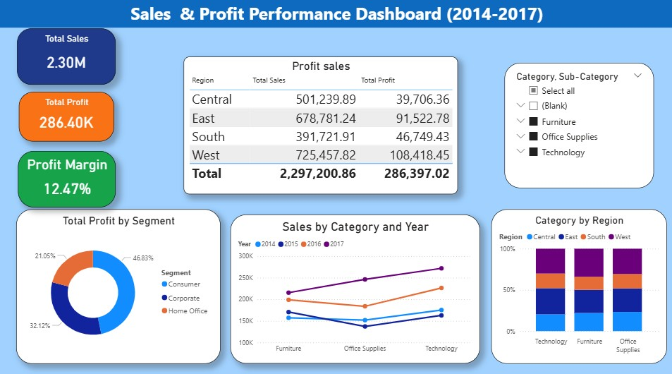

# 📊 Sales & Profit Performance Dashboard (2014–2017)

## 🔹 Project Overview
This Power BI dashboard analyzes sales and profit performance from 2014 to 2017.

## 🔹 Key KPIs
- Total Sales: 2.30M
- Total Profit: 286.40K
- Profit Margin: 12.47%

## 🔹 Insights
- West region generated the highest profit.
- Technology category shows consistent growth.
- Consumer segment contributes highest share.

## 🔹 Tools Used
- Power BI
- DAX (Measures)
- Data Modeling

## 🔹 DAX Measures

Profit Margin:
```DAX
Profit Margin = DIVIDE([Total Profit], [Total Sales])

## 📊 Dashboard Preview


